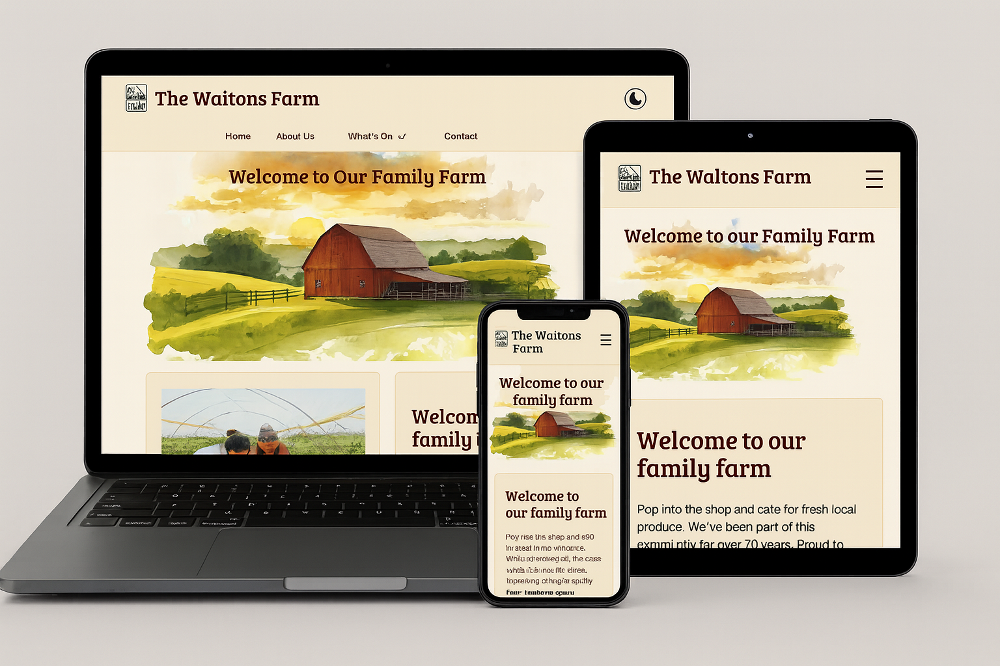

# The Walton Family Farm

### Responsive Layout


[Deployed Website](https://tonywalker-coder.github.io/familyfarm/)

## License

This project is licensed under the MIT License.
You are free to use, modify, distribute, and build upon this project for personal or commercial purposes.
See the full license in the [**LICENSE**](LICENSE) file for complete details

## Purpose of This README

This **README** is designed to guide the project from the very beginning, outlining the planning, structure, and development approach before and during the build. It isn’t intended to contain every asset or completed detail up front. Instead, it works alongside the project’s supporting documents — such as wireframes, design references, and testing documentation — which are developed and refined as the site evolves. Together, these documents form the full project record, with the **README** acting as the starting point.

### Supporting Documentation

[Wire Frames](docs/wireframe.pdf)  
[Design Reference](docs/Design.md)  
[Testing Documentation](testing/testing.md)

## Table of Contents

- [Introduction](#introduction)
- [Overview](#overview)
- [Objectives](#objectives)
- [User Stories](#user-stories)
  - [Visual Aspect (*must have*)](#visual-aspect-of-website-must-have)
    - [Accessibility](#accessibility-acceptance-criteria)
  - [Activities Cards (*must have*)](#public-activities-cards-must-have)
  - [Public Activities (*must have*)](#public-activities-must-have)
  - [About Us (*must have*)](#about-us-must-have)
  - [Gallery (*should have*)](#gallery-should-have)
  - [Shop and Cafeteria (*should have*)](#shop-and-cafeteria-should-have)
  - [Booking Form (*should have*)](#booking-form-should-have)
  - [Newsletter (*could have*)](#newsletter-could-have)
  - [Historical Story (*could have*)](#historical-story-could-have)
- [Design Reference](#design-reference)
- [Tech Stack](#tech-stack)
- [Folder Structure](#folder-structure)
- [Local Deployment](#local-deployment)
- [Workflow Section](#workflow-section)
- [Attribution](#attribution)

## Introduction

The Walton Family Farm website is a community‑focused, responsive web project designed to promote the farm’s activities, support commercial growth, and strengthen its role within the local community. This README outlines the project goals, user stories, accessibility requirements, and development roadmap.

## Overview

The Walton Family Farm website is being built to support two equally important goals: helping the farm stay commercially sustainable and strengthening its role within the local community. The project breaks these goals down into clear objectives so development can be planned in a sensible order, starting with the essentials **"must haves"** and working through the **"should & could haves”** as time allows. The README sets out the user stories, priorities, and structure needed to guide the build, testing, and keep the project organised within **GitHub**.

### Objectives

1. Start readme.md
2. Create storyboards
3. Create wireframe
4. Create file structure
5. Create known boilerplate templates
6. First deployment on **GitHub**
7. Create a project with storyboards in **'GitHub projects'**

## User Stories

The Walton Family Farm has two clear missions: commercial viability and increasing the farm's community image. There is an opportunity for a solution to address both missions, thereby creating an overlap.

1 Commercial viability  
Ensuring the farm attracts visitors and generates sustainable income.

- Increase awareness of public activities.
- Showcase the seasonal activities.
- Farm café.
- Newsletter.

2 Increase the farm's image within the local community
It is important to the farm that they are seen as an essential part of the local community.

- About us page containing farm information with images
- Awareness of historical interest on the farm with images

3 Area where both interest overlap
The farming show is an ideal example where the farm act as a community event while still addressing its need for financial stability.

- Farm shop with images.
- Farm show.
- Contact information.
- School trips.

## Visual aspect of website (must have)

As a first‑time visitor to the farm’s website, I want a visually engaging homepage with clear activity cards and community links so that I can quickly understand what the farm offers and explore activities that interest me.

### Accessibility acceptance criteria

- All inputs have associated \<label> elements
- Component is fully keyboard navigable.
- Screen readers can identify the purpose of the element.
- Colour contrast meets WCAG AA.

- The site must be fully responsive over all major platforms.
- Users must experience the same aspects of the site no matter what platform they are using.
- Styles must be consistent across the site.
- The home page will set the theme to be carried across the sub pages.
- Link libraries fonts and scripts.
- Navbar should remain fixed at all times.
- Footer is to be positioned at the bottom of the screen.
- Email links should be with contact information in footer.

- [ ] create boilerplate index.html
- [ ] create boiler plate styles.css
- [ ] create fixed header
- [ ] create footer with visual positioning
- [ ] include links for contact information in footer

## Public activities cards (must have)

As a first time visitor I want the activity cards to visually draw me in and encourage me to explore the activities page and be intrigued to see there are also seasonal activities.

- Visual impact on the homepage.
- Must be fully responsive without loosing any impact.

- [ ] create cards on the homepage
- [ ] cards should be responsive on all screens

## Public activities (must have)

As a visitor who clicked through from the homepage page, I want the activities page to follow the same exciting theme as the cards that drew me in so that the experience feels consistent and engaging.

- Clean, uncluttered page making use of grid structure.
- Activities and seasonal activities to have their own page.
- Link back and forth between daily activities and seasonal activities.
- Link to booking forms.
- All inputs have associated \<label> elements.
- Component is fully keyboard navigable.
- Screen readers can identify the purpose of the element.

- [ ] create activities.html and seasonal.html
- [ ] page should be responsive on all screens
- [ ] booking form button to be styled as part of the design

## About Us (must have)

As a visitor interested in the farm’s community impact, I want an easy‑to‑find, engaging About Us page so that I can understand the farm’s values and share feedback.

- This page can introduce additional facts about the farm.
- Aesthetic layout is prioritised, with correct column usage across all screen sizes.
- A feedback form is included and visually integrated into the design.
- All inputs have associated \<label> elements.
- Component is fully keyboard navigable.
- Screen readers can identify the purpose of the element.

- [ ] create about.html
- [ ] the page presents across all media and adjust if necessary
- [ ] create a feedback form

## Gallery (should have)

As a visitor, I want a visually engaging gallery so that I can feel the excitement of the farm experience and be inspired to visit.

- Should look to build a clean and tight collage that's reactive to different media.
- Try to blend images together where possible.

- [ ] create a gallery on its own page gallery.html
- [ ] use a masonry layout to suit a wide variety of images and media

## Shop and Cafeteria (should have)

As a visitor interested in local produce, I want a page that showcases both the farm shop and cafeteria so that I’m excited to experience both during my visit.

- The page presents the shop and cafeteria with a clear visual divide while still feeling unified.
- Layout uses a grid system to keep both sections balanced and non‑overlapping.
- The design should allow for future expansion, including potential external links.

- [ ] create shopandcafe.html
- [ ] use a grid system to present both venues cleanly on the same page
- [ ] ensure layout can grow to include external links in future

## Booking Form (should have)

As a visitor making a booking I want the form to be clear and easy to use, so I can feel confident that my request has worked.

- Where a fixed set of options exist, the field must present only those options (e.g., title, event type).
- Required fields must force an input.
- Bootstrap validation must be used where available.
- Validation errors must be clearly displayed next to the relevant field.
- The booking form will include: name, title, contact phone, email, event type, date required, number of guest and a free‑text section (the free‑text field is optional; all others are required).
- On successful completion the visitor will receive a clear success message.
- Colour contrast meets WCAG AA.
- All inputs have associated \<label> elements.
- Component is fully keyboard navigable.
- Screen readers can identify the purpose of the element.
- Icons include accessible text alternatives.

- [ ] create bookingform.html
- [ ] create success.html
- [ ] create check boxes and dropdowns as required
- [ ] use required and validations where necessary
- [ ] add a submit button
- [ ] launch a success page on completion

## Newsletter (could have)

As a visitor interested in current and upcoming activities, I want to sign up for a newsletter so that I can stay informed about future events at the farm.

- A clear call‑to‑action button is present and opens a newsletter sign-up form.
- The button follows the site’s visual theme and styling.
- The call‑to‑action is clearly visible and integrated into the layout.
- Modal traps focus and returns focus to the trigger.
- Colour contrast meets WCAG AA.
- All inputs have associated \<label> elements.
- Component is fully keyboard navigable.
- Screen readers can identify the purpose of the element.
- Icons include accessible text alternatives.

- [ ] create a call to action button that opens a modal form
- [ ] create a form to sign up for newsletter
- [ ] when complete return to the call point

## Historical Story (could have)

As a visitor interested in the farm’s historical sites, I want a page that provides clear insight and information so that I can learn more about the farm’s past.

- The page uses images and text to present fact‑filled historical segments.
- The layout follows the existing site structure and styling for consistency.

- [ ] create historical.html
- [ ] launch from about.htm
- [ ] use the current layout and styling that is already in place

## Design Reference

All design decisions, colour palettes, and wireframes and testing can be found here:

[Wire Frames](docs/wireframe.pdf)  
[Design Reference](docs/design.md)  
[Testing Documentation](testing/testing.md)

## Tech Stack

- HTML5
- CSS3
- JavaScript
- GitHub Pages (deployment)
- GitHub Project (user stories)
- Copilot (website text articles)
- Balsamiq (wireframes)
- Code Institute (forms return status)
- w3.org (validators)

## Folder Structure

```text

└── 📁familyfarm
    └── 📁assets
        └── 📁css
            └── style.css
        └── 📁favicon
        └── 📁fonts
        └── 📁gallery
        └── 📁images
        └── 📁svg
    └── 📁docs
        ├── Changelog.md
        ├── Design.md
        └── wireframe.pdf
    └── 📁screenshots
    └── 📁docs
        └── testing.md
    └── 📁testing
    ├── .gitignore
    ├── about.html
    ├── activities.html
    ├── app.js
    ├── gallery.html
    ├── historical.html
    ├── index.html
    ├── LICENSE
    ├── README.md
    ├── seasonal.html
    └── shopandcafe.html
```

## Local Deployment

1. Clone the [repository.](https://github.com/TonyWalker-coder/familyfarm)
2. Open index.html in your browser or IDE.
3. Consult /README.md & /docs/Design.md

## Workflow Section

Development follows a **“must‑have”** first workflow using [GitHub Projects.](https://github.com/users/TonyWalker-coder/projects/3) Each user story is represented as a card and moves through To Do → In Progress → Done.

## Attribution

This project includes references and acknowledgements throughout the README, design document, testing document, and HTML files. The purpose of this section is to consolidate all remaining attributions in one place.

The images used across the site were selected to give the impression of a commercially viable product. However, they are in fact stock images sourced from [Adobe Stock Images.](https://stock.adobe.com/uk) These assets are copyright‑free and permitted for use within an educational context.

As the project does not utilise the Bootstrap framework, all interactive behaviour is implemented using custom JavaScript. Due to my limited prior experience with JavaScript, I consulted external resources to understand available methods and best practices. While the scripts themselves are original, the underlying concepts and techniques were informed by guidance from [W3Schools](https://www.w3schools.com/) and [Free Java Scripts – java-scripts.net.](https://www.java-scripts.net)

The project logo was generated by Microsoft Copilot based solely on a written description provided by the user. No external images, trademarks, or copyrighted materials were referenced during its creation. Any resemblance to existing logos or brand identities is entirely unintentional and coincidental.

The website requires substantial article content to populate various text sections. To maintain relevance and avoid the use of placeholder text such as Lorem Ipsum, I used Copilot to generate topic‑appropriate written content for the site.

Although I initially intended to implement a dedicated success page for form submissions, this would have required a database to store and process user input. As this fell outside the intended scope of the project, I instead used the Code Institute form dump service to demonstrate successful POST submission.

Certain CSS rules within this project make use of WebKit‑specific vendor prefixes to ensure consistent rendering across browsers that rely on the WebKit engine or maintain partial compatibility with it. These prefixes were applied to improve cross‑browser support for features such as gradients, transitions, and form element styling. Where possible, standard CSS properties are included alongside their prefixed counterparts to maintain broad compatibility and adhere to best practices.
