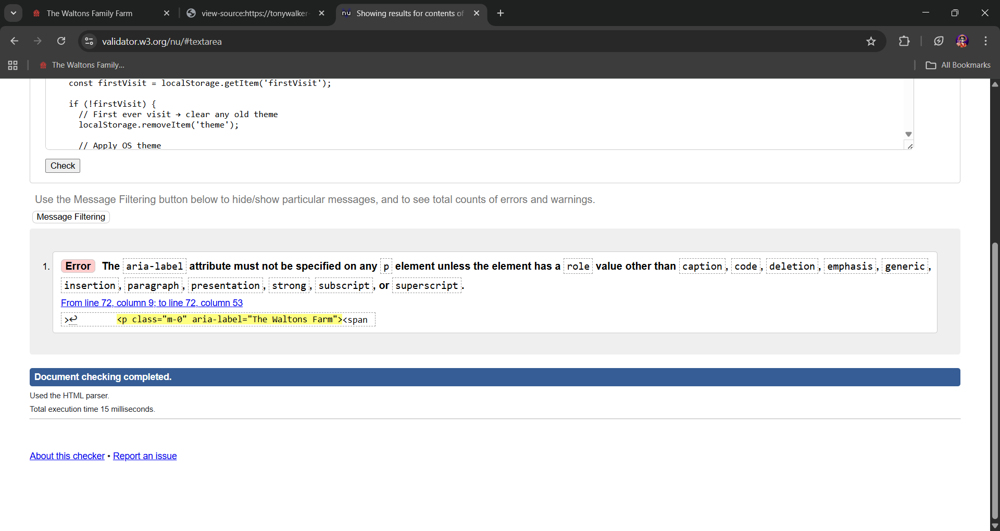
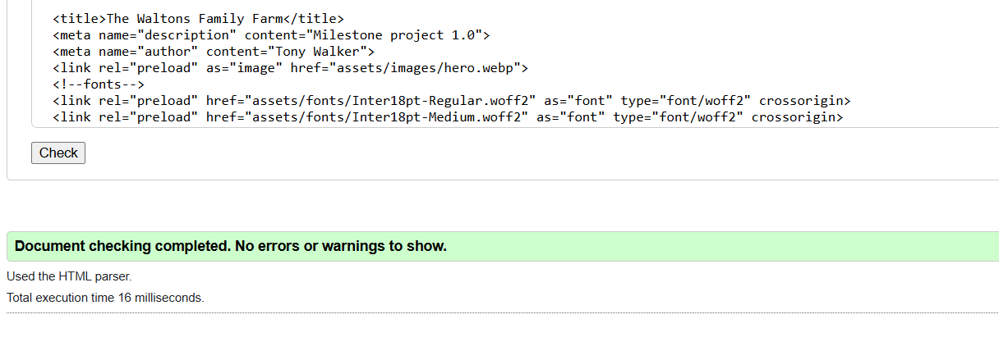
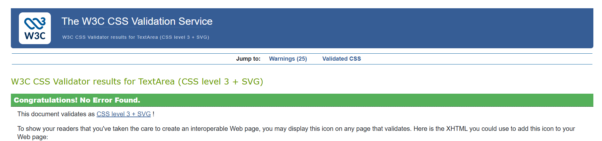
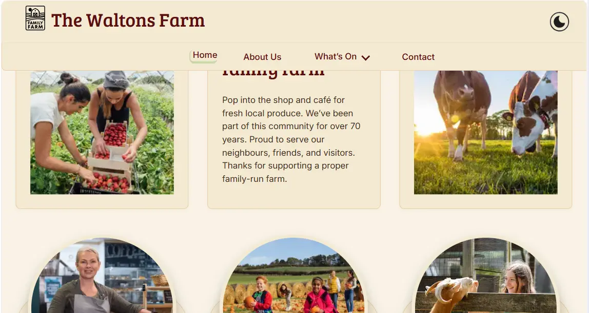
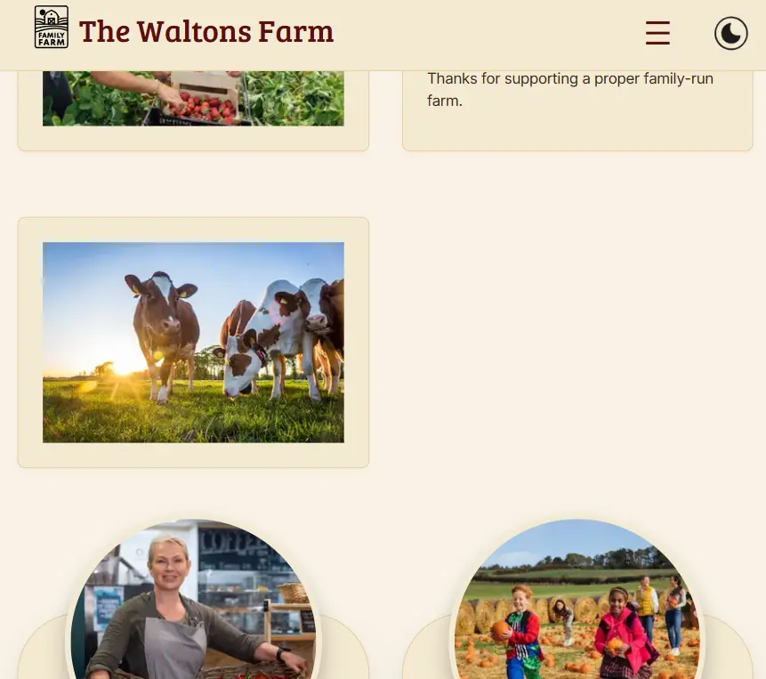
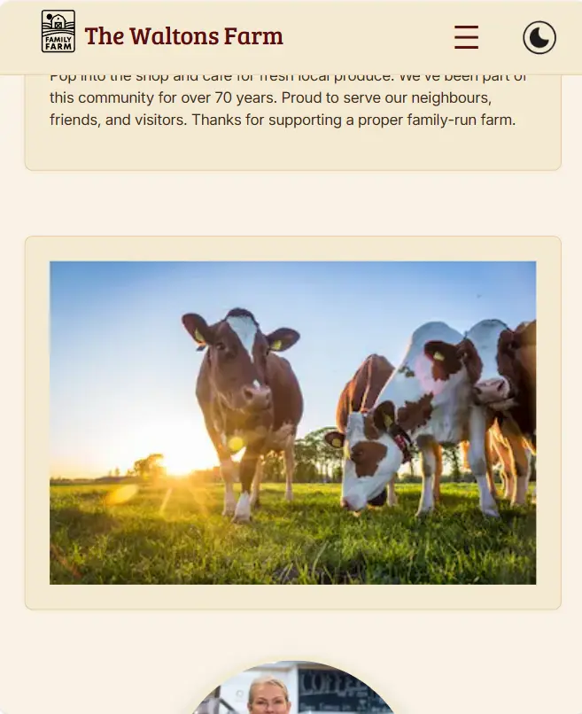

# Testing

## Introduction & Purpose

The purpose of this testing document is to demonstrate the full verification process carried out on **The Waltons Family Farm website.** This includes:

- Functional testing of navigation, interactive components, and user flows
- Accessibility checks using screen readers, keyboard navigation, and ARIA validation
- HTML, CSS, and JavaScript validation
- Responsive design testing across multiple devices and breakpoints
  - This site does not use Bootstrap as a dependency, but has used its breakpoint system as a professional reference point while building it's own responsive layout.
- Browser compatibility checks
- Bug tracking and resolutions
- Evidence screenshots stored in the /testing directory
This document ensures the site meets the expected standards for usability, accessibility, and reliability, and provides a clear audit trail of the testing process.

## Table of Contents

- [Introduction & Purpose](#introduction--purpose)
- [Validation](#validation)
- [Markup Validation](#markup-validation)
  - [index.html](#index)
  - [about.html](#about)
  - [historical.html](#historical)
  - [activities.html](#activities)
  - [seasonal.html](#seasonal)
  - [shopandcafe.html](#shopandcafe)
  - [gallery.html](#gallery)
- [Chrome Lighthouse Stats](#chrome-lighthouse)
- [Css Validation](#css-validation)
- [Navigation](#navigation)
  - [Desktop Links](#desktop-links)
- [Visual Acceptance Test](#visual-acceptance-test)
  - [Objective,Scope](#objective)
  - [Scope](#scope)
  - [Combined Visual Acceptance Matrix](#desktop-matrix)
- [Visual Observation](#observation)
  - [Form State After Submission](#vo1)
  - [Mobile and Bootstrap xs Breakpoint](#vo2)
  - [Hero Text](#hero-text)
  - [Box Elements and Dark Theme](#box-elements-and-dark-theme)
- [User Story Verification](#user-story-verification)
- [Known Bugs and Features](#known-bugs-and-features)
  - Responsive Grid: Uneven Rows on Small Breakpoints

## Validation

- HTML validated using W3C Validator
- CSS validated using W3C CSS Validator
- JavaScript checked manually (no console errors)

## Markup Validation

### index.html

validation-err-01

#### Fix for validation-err-01

The *aria-label* attribute was removed from the \
 element because it was unnecessary. The visible text **‘The Waltons Farm’** is already fully descriptive for screen readers, and the *W3C validator* correctly flagged that *aria-label* must not be used on a \
  without a special role.

#### Final Validation for index.html

Pass no errors

### about.html

#### Validation for about.html

Pass no errors

### historical.html

validation-02 **x12**

#### Fix for Error validation-err-02

cut and paste error 2 x role="" in the same element  

\

remove role="listitem"

#### Final Validation for historical.html

Pass no errors

### activities.html

#### Validation for activities.html

Pass no errors

### seasonal.html

#### Validation for seasonal.html

Pass no errors

### shopandcafe.html

#### Validation for shopandcafe.html

Pass no errors

### gallery.html

#### Validation for gallery.html

Pass no errors

## Chrome Lighthouse

Lighthouse audits are run at key milestones to confirm that performance, accessibility standards remain stable.

**Light Theme**

**Dark Theme**

## CSS Validation

)

Warnings (25)  
207		Due to their dynamic nature, CSS variables are currently not statically checked  
214		Due to their dynamic nature, CSS variables are currently not statically checked  
221		Due to their dynamic nature, CSS variables are currently not statically checked  
228		Due to their dynamic nature, CSS variables are currently not statically checked  
236		Due to their dynamic nature, CSS variables are currently not statically checked  
244		Due to their dynamic nature, CSS variables are currently not statically checked  
256		Due to their dynamic nature, CSS variables are currently not statically checked  
269		Due to their dynamic nature, CSS variables are currently not statically checked  
286		Due to their dynamic nature, CSS variables are currently not statically checked  
326		Due to their dynamic nature, CSS variables are currently not statically checked  
355		Due to their dynamic nature, CSS variables are currently not statically checked  
383		Due to their dynamic nature, CSS variables are currently not statically checked  
425		auto is not defined by any specification as an allowed value for pointer-events, but is supported in multiple browsers  
484		Due to their dynamic nature, CSS variables are currently not statically checked  
700		-webkit-user-select is a vendor extension  
840		-webkit-user-select is a vendor extension  
918		Due to their dynamic nature, CSS variables are currently not statically checked  
919		Due to their dynamic nature, CSS variables are currently not statically checked  
969		Due to their dynamic nature, CSS variables are currently not statically checked  
991		Due to their dynamic nature, CSS variables are currently not statically checked  
1105		auto is not defined by any specification as an allowed value for pointer-events, but is supported in multiple browsers  
1229		-webkit-backdrop-filter is a vendor extension  
1312		Due to their dynamic nature, CSS variables are currently not statically checked  
1316		Due to their dynamic nature, CSS variables are currently not statically checked  
1347		Due to their dynamic nature, CSS variables are currently not statically checked  

| Warning Type | Meaning | Fix | Why It’s Safe |
|--------------|---------|-------------------|----------------|
| CSS variables not statically checked | Validators can’t validate dynamic `var(--x)` values | No | Browsers resolve variables at runtime, and all modern engines fully support them. |
| `pointer-events: auto` | Spec quirk, but fully supported in all major browsers | Optional | `auto` is the default behavior; every browser treats it correctly even if the spec wording is fuzzy. |
| `-webkit-user-select` | Safari vendor prefix for text‑selection control | No | Safari still requires this prefix for consistent behavior. Using it is the correct cross‑browser pattern. |
| `-webkit-backdrop-filter` | Safari vendor prefix for backdrop blur | No | Safari’s implementation is still prefixed. Including it ensures the effect works everywhere it’s supported. |  
*explanations to warning can be found on w3.org documentation*

## Navigation

### Navigation Test

All navigation elements must direct users to their correct destinations. This includes every link and every button, each of which should perform its intended action. The test covers every instance of each link or button across the site.

#### Desktop Links

| **Link**            | **Index** | **About** | **Activities** | **Seasonal** | **Shop** | **Gallery** | **Historical** |
|---------------------|-----------|-----------|----------------|--------------|----------|-------------|----------------|
| Home                                    | [✓] | [✓] | [✓] | [✓] | [✓] | [✓] | [✓]
| About Us                                | [✓] | [✓] | [✓] | [✓] | [✓] | [✓] | [✓]
| Whats On                                | [✓] | [✓] | [✓] | [✓] | [✓] | [✓] | [✓]
| Activities                              | [✓] | [✓] | [✓] | [✓] | [✓] | [✓] | [✓]
| Seasonal                                | [✓] | [✓] | [✓] | [✓] | [✓] | [✓] | [✓]
| Shop & Cafe                             | [✓] | [✓] | [✓] | [✓] | [✓] | [✓] | [✓]
| Gallery                                 | [✓] | [✓] | [✓] | [✓] | [✓] | [✓] | [✓]
| Contact                                 | [✓] | [✓] | [✓] | [✓] | [✓] | [✓] | [✓]
| Dark theme toggle                       | [✓] | [✓] | [✓] | [✓] | [✓] | [✓] | [✓]
| Sign Up (newsletter)                    | [✓] | [✓] | [✓] | [✓] | [✓] | [✓] | [✓]
| Newsletter Modal *'Cancel'*             | [✓] | [✓] | [✓] | [✓] | [✓] | [✓] | [✓]
| Newsletter Modal *'Subscribe'*          | [✓] | [✓] | [✓] | [✓] | [✓] | [✓] | [✓]
| Newsletter Modal 'X'                    | [✓] | [✓] | [✓] | [✓] | [✓] | [✓] | [✓]
| Newsletter Modal *'outside page click'* | [✓] | [✓] | [✓] | [✓] | [✓] | [✓] | [✓]
| Facebook Icon                           | [✓] | [✓] | [✓] | [✓] | [✓] | [✓] | [✓]
| Instagram Icon                          | [✓] | [✓] | [✓] | [✓] | [✓] | [✓] | [✓]
| Twitter / 'X' Icon                      | [✓] | [✓] | [✓] | [✓] | [✓] | [✓] | [✓]
| YouTube Icon                            | [✓] | [✓] | [✓] | [✓] | [✓] | [✓] | [✓]
| Historical Link                         | [N/A] | [✓] | [N/A] | [N/A] | [N/A] | [N/A] | [N/A]
| Leave Feedback                          | [N/A] | [✓] | [N/A] | [N/A] | [N/A] | [N/A] | [N/A]
| Feedback Form *'Cancel'*                | [N/A] | [✓] | [N/A] | [N/A] | [N/A] | [N/A] | [N/A]
| Feedback Form *'Subscribe'*             | [N/A] | [✓] | [N/A] | [N/A] | [N/A] | [N/A] | [N/A]
| Feedback Form 'X'                       | [N/A] | [✓] | [N/A] | [N/A] | [N/A] | [N/A] | [N/A]
| Feedback Form *'outside page click'*    | [N/A] | [✓] | [N/A] | [N/A] | [N/A] | [N/A] | [N/A]
| Booking Form                            | [N/A] | [N/A] | [✓] | [✓] | [N/A] | [N/A] | [N/A]
| Booking Form *'Cancel'*                 | [N/A] | [N/A] | [✓] | [✓] | [N/A] | [N/A] | [N/A]
| Booking Form *'Subscribe'*              | [N/A] | [N/A] | [✓] | [✓] | [N/A] | [N/A] | [N/A]
| Booking Form 'X'                        | [N/A] | [N/A] | [✓] | [✓] | [N/A] | [N/A] | [N/A]
| Booking Form *'outside page click'*     | [N/A] | [N/A] | [✓] | [✓] | [N/A] | [N/A] | [N/A]
| Slide show operation                    | [N/A] | [N/A] | [N/A] | [N/A] | [✓] | [N/A] | [✓]

| Device              | **open** | **close** | **navigation** |
|---------------------|----------|-----------|----------------|
| Mobile (hamburger)  | [✓] | [✓] | [✓] |

## Visual Acceptance Test

### Objective

Evaluate the final rendered page as a complete visual experience. This test ensures the interface feels coherent, accessible, and polished across both light and dark modes.

### Scope

#### This test covers the following visual elements:

- Typography consistency, hierarchy, and readability
- Image quality, alignment, cropping, and responsiveness
- Colour palette accuracy and thematic cohesion
- Contrast ratios and accessibility compliance
- Visual balance, spacing, and overall layout integrity
- Behaviour of all visual elements when switching between light and dark mode
Preconditions
- Page is fully built with all assets loaded
- Light/dark mode toggle is functional
- Browser zoom set to 100%
- No dev tools overlays or forced colour modes active

#### Test Steps

1. Load the page in light mode.
2. Observe the page holistically without interacting — assess first impressions.
3. Inspect typography for consistency in size, weight, and spacing.
4. Review all images for clarity, correct cropping, and alignment.
5. Check colour usage against the design palette.
6. Validate contrast ratios for text, buttons, and interactive elements.
7. Switch to dark mode.
8. Repeat steps 2–6, noting any mismatches or regressions.
9. Resize the viewport (desktop → tablet → mobile) and confirm visual stability.

#### Expected Results

- Fonts appear consistent, readable, and correctly scaled.
- Images load crisply, align with surrounding content, and maintain aspect ratio.
- Colour palette matches design intent in both modes.
- Contrast meets accessibility standards (WCAG AA or higher).
- No visual artefacts, layout shifts, or mismatched tokens appear when toggling modes.
- The page feels cohesive, intentional, and visually balanced at all breakpoints.
Pass/Fail Criteria
- Pass: All visual elements meet the expected results with no significant deviations.
- Fail: Any visual inconsistency, contrast issue, misaligned asset, or mode‑specific regression is observed.

## Combined Visual Acceptance Matrix — Desktop / Tablet / Mobile

| **Check Category**            | **Viewport** | **Index** | **About** | **Activities** | **Seasonal** | **Shop** | **Gallery** | **Historical** | **Newsletter** | **Feedback** | **Booking** |
|-------------------------------|--------------|-----------|-----------|----------------|--------------|----------|-------------|----------------|----------------|--------------|-------------|
| **Typography**                | Desktop      | ✓ | ✓ | ✓ | ✓ | ✓ | ✓ | ✓ | ✓ | ✓ | ✓ |
|                               | Tablet       | ✓ | ✓ | ✓ | ✓ | ✓ | ✓ | ✓ | ✓ | ✓ | ✓ |
|                               | Mobile       | ✓ | ✓ | ✓ | ✓ | ✓ | ✓ | ✓ | ✓ | ✓ | ✓ |
| **Images**                    | Desktop      | ✓ | ✓ | ✓ | ✓ | ✓ | ✓ | ✓ | ✓ | ✓ | ✓ |
|                               | Tablet       | ✓ | ✓ | ✓ | ✓ | ✓ | ✓ | ✓ | ✓ | ✓ | ✓ |
|                               | Mobile       | ✓ | ✓ | ✓ | ✓ | ✓ | ✓ | ✓ | ✓ | ✓ | ✓ |
| **Colour & Palette**          | Desktop      | ✓ | ✓ | ✓ | ✓ | ✓ | ✓ | ✓ | ✓ | ✓ | ✓ |
|                               | Tablet       | ✓ | ✓ | ✓ | ✓ | ✓ | ✓ | ✓ | ✓ | ✓ | ✓ |
|                               | Mobile       | ✓ | ✓ | ✓ | ✓ | ✓ | ✓ | ✓ | ✓ | ✓ | ✓ |
| **Contrast & Accessibility**  | Desktop      | ✓ | ✓ | ✓ | ✓ | ✓ | ✓ | ✓ | ✓ | ✓ | ✓ |
|                               | Tablet       | ✓ | ✓ | ✓ | ✓ | ✓ | ✓ | ✓ | ✓ | ✓ | ✓ |
|                               | Mobile       | ✓ | ✓ | ✓ | ✓ | ✓ | ✓ | ✓ | ✓ | ✓ | ✓ |
| **Layout & Spacing**          | Desktop      | ✓ | ✓ | ✓ | ✓ | ✓ | ✓ | ✓ | ✓ | ✓ | ✓ |
|                               | Tablet       | ✓ | ✓ | ✓ | ✓ | ✓ | ✓ | ✓ | ✓ | ✓ | ✓ |
|                               | Mobile       | ✓ | ✓ | ✓ | ✓ | ✓ | ✓ | ✓ | ✓ | ✓ | ✓ |
| **Light/Dark Mode Behaviour** | Desktop      | ✓ | ✓ | ✓ | ✓ | ✓ | ✓ | ✓ | ✓ | ✓ | ✓ |
|                               | Tablet       | ✓ | ✓ | ✓ | ✓ | ✓ | ✓ | ✓ | ✓ | ✓ | ✓ |
|                               | Mobile       | ✓ | ✓ | ✓ | ✓ | ✓ | ✓ | ✓ | ✓ | ✓ | ✓ |
| **Breakpoint Stability**      | Desktop      | ✓ | ✓ | ✓ | ✓ | ✓ | ✓ | ✓ | ✓ | ✓ | ✓ |
|                               | Tablet       | ✓ | ✓ | ✓ | ✓ | ✓ | ✓ | ✓ | ✓ | ✓ | ✓ |
|                               | Mobile       | ✓ | ✓ | ✓ | ✓ | ✓ | ✓ | ✓ | ✓ | ✓ | ✓ |
| **General Visual Cohesion**   | Desktop      | ✓ | ✓ | ✓ | ✓ | ✓ | ✓ | ✓ | ✓ | ✓ | ✓ |
|                               | Tablet       | ✓ | ✓ | ✓ | ✓ | ✓ | ✓ | ✓ | ✓ | ✓ | ✓ |
|                               | Mobile       | ✓ | ✓ | ✓ | ✓ | ✓ | ✓ | ✓ | ✓ | ✓ | ✓ |

## Visual Observations

### Form State After Submission

The form was tested using the Code Institute formdump endpoint, which returns a simple POST‑echo page showing the submitted field names and values. Because the endpoint does not redirect or reload the original form, using the browser’s Back button returns to the form exactly as it was before submission, with all fields still populated. This is expected behaviour for a non‑redirecting POST test service and should not be interpreted as an error.

### Mobile and Bootstrap xs Breakpoint

After reviewing the layout on an actual mobile device, it became clear that Bootstrap’s default breakpoints weren’t accurately reflecting real‑world behaviour. The issue was amplified by the fact that DevTools emulation, while useful as a rough guide, failed to reproduce the true viewport dimensions and rendering quirks of the physical screen. Once the design was tested on a real handset, the mismatch became obvious, and a more realistic breakpoint was introduced at 400px to align the layout with how users actually experience the interface.

### Hero Text

The **.hero h1** text was failing contrast requirements because the hero image doesn’t change between light and dark themes. That meant the **h1** became unreadable when the theme switched. To address this, the **.hero h1** styling is now kept consistent across theme toggles, ensuring the primary heading always maintains sufficient contrast against the static hero background.

### Box Elements and Dark Theme

To preserve clarity in dark mode, the colour‑themed box elements needed a non‑standard cream border. This ensured the components stayed sharp and well‑defined against the darker background, preventing them from visually collapsing into the theme.

## User Story Verification

### Commercial viability  

- Increase awareness of public activities.
- Showcase the seasonal activities.
- Farm café.
- Newsletter.

**✓ Pages generated for all these areas**

### Increase the farm's image within the local community

- About us page containing farm information with images
- Awareness of historical interest on the farm with images

**✓ Pages generated for all these areas**

## Area of overlapping interest

- Farm shop with images.
- Farm show.
- Contact information.
- School trips.

**✓ Pages generated to include these intrest**

## Visual aspect of website

- ### Accessibility

**✓ The site complies with all known accessibility standards**

- The site must be fully responsive over all major platforms.
- Users must experience the same aspects of the site no matter what platform they are using.
- Styles must be consistent across the site.
- The home page will set the theme to be carried across the sub pages.
- Link libraries fonts and scripts.
- Navbar should remain fixed at all times.
- Footer is to be positioned at the bottom of the screen.
- Email links should be with contact information in footer.

**✓ All of the above criteria has been meet**

## Public activities cards

The activity cards to visually draw me in and encourage me to explore the activities page and be intrigued to see there are also seasonal activities.

**✓ Activity cards where designed with this site in mind to meet the criteria**

## Public activities

I want the activities page to follow the same exciting theme as the cards that drew me in so that the experience feels consistent and engaging.

- Clean, uncluttered page making use of grid structure.
- Activities and seasonal activities to have their own page.
- Link back and forth between daily activities and seasonal activities.

**✓ The site follows a consitent theme through out and if fully navigable from any page, both activity pages contain a separate booking form**

## About Us

As a visitor interested in the farm’s community impact, I want an easy‑to‑find, engaging About Us page

- This page can introduce additional facts about the farm.
- Aesthetic layout is prioritised, with correct column usage across all screen sizes.
- A feedback form is included and visually integrated into the design.

**✓ This page contains information cards further links and responsive feed back form**

## Gallery

As a visitor, I want a visually engaging gallery

**✓ The site has a fully responsive gallery page**

## Shop and Cafeteria

I want a page that showcases both the farm shop and cafeteria

- The page presents the shop and cafeteria with a clear visual divide while still feeling unified.
- Layout uses a grid system to keep both sections balanced and non‑overlapping.
- The design should allow for future expansion, including potential external links.

**✓ this page follows the same consistent theme as the rest on the site and is built as a modular system using system token making future changes easy and adaptable**

## Booking Form

As a visitor making a booking I want the form to be clear and easy to use, so I can feel confident that my request has worked.

**✓ All forms stand separate from the calling page and have fields that verify content, at the moment the page simulates a success page with a form dump**

## Newsletter

As a visitor interested in current and upcoming activities, I want to sign up for a newsletter so that I can stay informed about future events at the farm.

**✓ The news letter sign up can be accessed from every page**

## Historical Story

As a visitor interested in the farm’s historical sites, I want a page that provides clear insight and information so that I can learn more about the farm’s past.

- The page uses images and text to present fact‑filled historical segments.
- The layout follows the existing site structure and styling for consistency.

**✓ This page follows the siste wide theme and layout and has its own interactive gallery**

## Known Bugs and Features

## Responsive Grid: Uneven Rows on Small Breakpoints

The layout uses a custom CSS Grid with responsive values. At the  breakpoint (based on **Bootstrap‑style** sizing, but implemented in pure CSS), three cards naturally form a 2 + 1 layout. This happens because the available column width supports two cards per row, leaving the third to wrap onto its own line.  
This feature has been intentionally kept. It avoids forced stretching, preserves consistent card proportions, and maintains predictable, readable layouts across breakpoints. At the smallest sizes (**xs**), cards stack vertically for clarity.

lg:  
[1][2][3]

md:  
[1][2][3]

sm:  
[1][2]  
[3]

xs:  
[1]  
[2]  
[3]  

